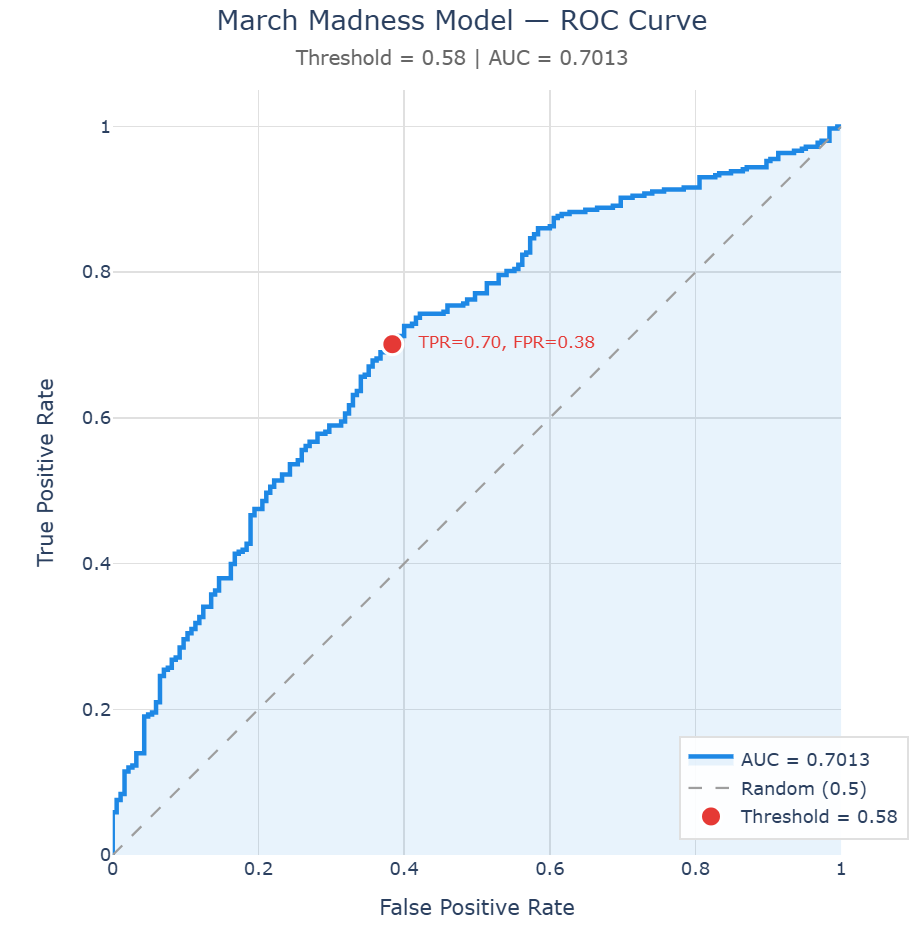
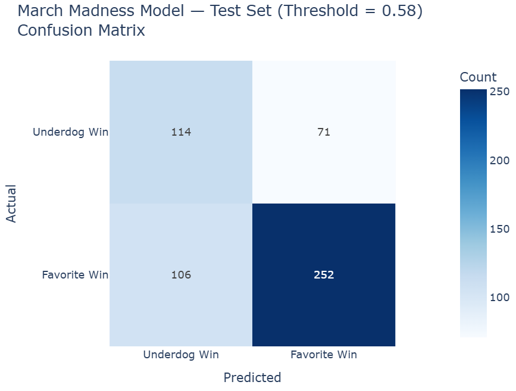
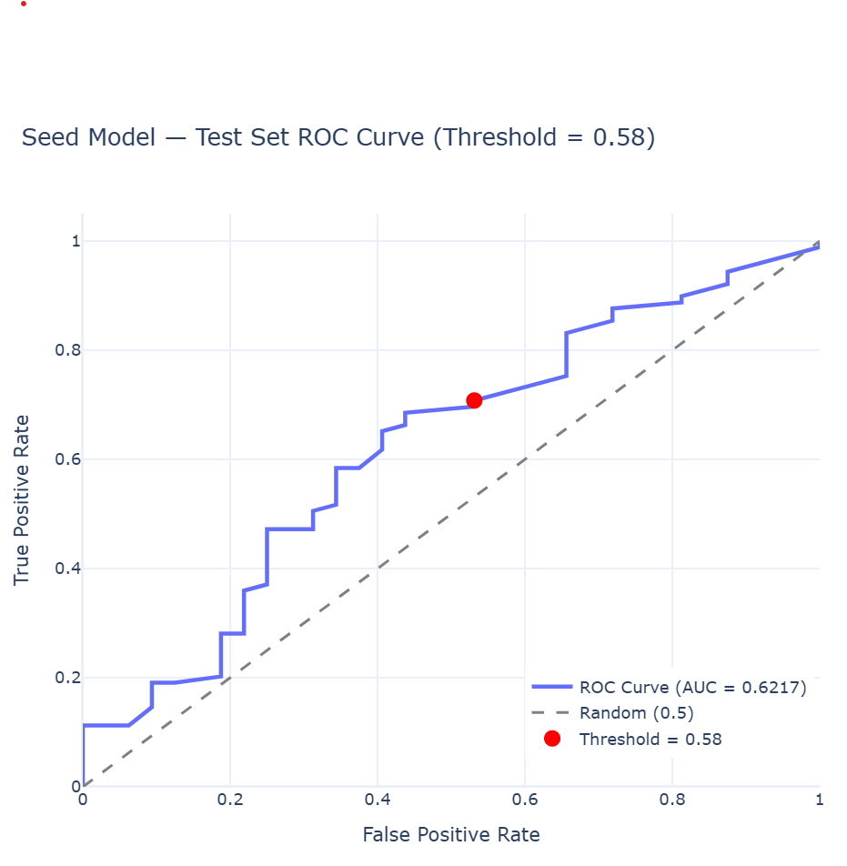
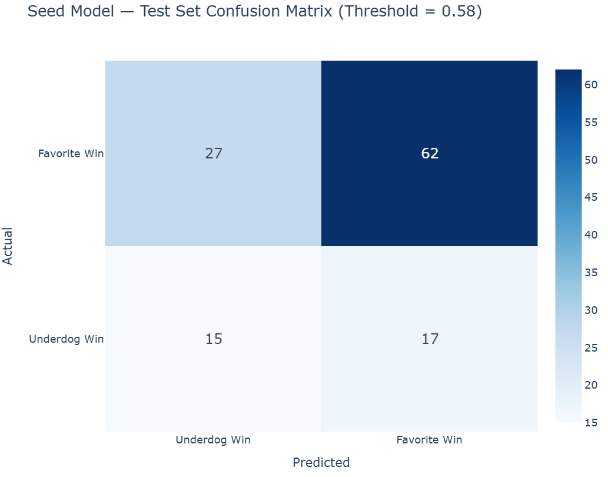

# NCAA Men's March Madness 2026 — Game Outcome Prediction

This project predicts the outcomes of 2026 NCAA Men's Basketball Tournament games by blending two machine learning models: an **In-Season Model** trained on 2025-2026 regular season game data, and a **Historical Seed Model** trained on tournament results from 2012-2025. The ensemble combines current team form with long-term tournament patterns to generate a full 63-game bracket.

**National Champion Pick: Michigan (1-seed)**

---

## Round 1 Predictions

The blended prediction represents the estimated probability that the **favored (lower-seeded) team wins**. When the blended probability falls below our upset threshold of 0.575, we pick the underdog.

| Region | Favorite | Underdog | Blended Pred | Final Pick | Correct? |
|--------|----------|----------|:------------:|------------|:--------:|
| East | (1) Duke | (16) Siena | 0.914 | **Duke** | |
| East | (8) Ohio State | (9) TCU | 0.495 | **TCU** | |
| East | (5) St John's | (12) Northern Iowa | 0.673 | **St John's** | |
| East | (4) Kansas | (13) CA Baptist | 0.605 | **Kansas** | |
| East | (6) Louisville | (11) South Florida | 0.511 | **South Florida** | |
| East | (3) Michigan St | (14) N Dakota St | 0.699 | **Michigan St** | |
| East | (7) UCLA | (10) UCF | 0.592 | **UCLA** | |
| East | (2) UConn | (15) Furman | 0.843 | **UConn** | |
| South | (1) Florida | (16) Prairie View A&M | 0.908 | **Florida** | |
| South | (8) Clemson | (9) Iowa | 0.570 | **Iowa** | |
| South | (5) Vanderbilt | (12) McNeese | 0.520 | **McNeese** | |
| South | (4) Nebraska | (13) Troy | 0.716 | **Nebraska** | |
| South | (6) North Carolina | (11) VCU | 0.526 | **VCU** | |
| South | (3) Illinois | (14) Penn | 0.822 | **Illinois** | |
| South | (7) Saint Mary's | (10) Texas A&M | 0.618 | **Saint Mary's** | |
| South | (2) Houston | (15) Idaho | 0.880 | **Houston** | |
| West | (1) Arizona | (16) Long Island | 0.915 | **Arizona** | |
| West | (8) Villanova | (9) Utah St | 0.542 | **Utah St** | |
| West | (5) Wisconsin | (12) High Point | 0.423 | **High Point** | |
| West | (4) Arkansas | (13) Hawaii | 0.573 | **Hawaii** | |
| West | (6) BYU | (11) Texas | 0.654 | **BYU** | |
| West | (3) Gonzaga | (14) Kennesaw St | 0.852 | **Gonzaga** | |
| West | (7) Miami (FL) | (10) Missouri | 0.670 | **Miami (FL)** | |
| West | (2) Purdue | (15) Queens (NC) | 0.829 | **Purdue** | |
| Midwest | (1) Michigan | (16) Howard | 0.860 | **Michigan** | |
| Midwest | (8) Georgia | (9) Saint Louis | 0.540 | **Saint Louis** | |
| Midwest | (5) Texas Tech | (12) Akron | 0.506 | **Akron** | |
| Midwest | (4) Alabama | (13) Hofstra | 0.590 | **Alabama** | |
| Midwest | (6) Tennessee | (11) Miami (OH) | 0.620 | **Tennessee** | |
| Midwest | (3) Virginia | (14) Wright St | 0.816 | **Virginia** | |
| Midwest | (7) Kentucky | (10) Santa Clara | 0.474 | **Santa Clara** | |
| Midwest | (2) Iowa St | (15) Tennessee St | 0.845 | **Iowa St** | |

**Round 1 upset picks (11):** TCU, South Florida, Iowa, McNeese, VCU, Utah St, High Point, Hawaii, Saint Louis, Akron, Santa Clara
---

## Table of Contents

1. [Approach](#approach)
2. [Data Sources](#data-sources)
3. [Feature Engineering](#feature-engineering)
4. [Model Architecture](#model-architecture)
5. [Upset Threshold Calibration](#upset-threshold-calibration)
6. [Model Performance](#model-performance)
7. [Inference Pipeline](#inference-pipeline)
8. [Full Tournament Bracket](#tournament-predictions)
9. [Year-Over-Year Improvements](#year-over-year-improvements)
10. [Future Directions](#future-directions)

---

## Approach

The prediction system works in three stages:

1. **In-Season Model** — Analyzes each team's 2025-2026 regular season performance using rolling statistics, last-10-game momentum, and leak-free quadrant features. This model captures current form: who is playing well right now, who has beaten good teams, and who has been exposed by bad losses.

2. **Historical Seed Model** — Looks at how specific seed matchups have played out historically in the NCAA tournament. A 5-vs-12 game has a known upset rate. A 1-vs-16 almost never goes to the underdog. This model provides a structural prior based on decades of tournament data.

3. **Ensemble Blending** — The two models are combined with a 63/37 weighting (in-season / historical) and an upset threshold derived from calibration analysis. When the blended probability falls below the threshold, the model picks the underdog.

---

## Data Sources

All data comes from the [March Machine Learning Mania](https://www.kaggle.com/competitions/march-machine-learning-mania-2025) competition on Kaggle.

| File | Description |
|------|-------------|
| `MRegularSeasonDetailedResults.csv` | Box scores for every regular season game |
| `MNCAATourneyDetailedResults.csv` | Box scores for every NCAA tournament game |
| `MNCAATourneySeeds.csv` | Tournament seeds by team and season |
| `MNCAATourneySlots.csv` | Bracket structure and round assignments |
| `MTeamSpellings.csv` | Team name variants mapped to TeamIDs |

The project filters regular season data to the **2026 season only**. The rationale is that the NIL era has fundamentally changed roster construction, making historical regular season data less representative of current team strength.

---

## Feature Engineering

### Rolling Season Averages

For each team and each game, we compute expanding season-to-date averages using a `shift(1)` pattern to prevent data leakage. Before game 15, the model only sees stats from games 1-14. The stats include scoring, shooting percentages, rebounds, assists, turnovers, steals, blocks, fouls, and derived metrics like point differential and assist-to-turnover ratio.

### Last-10-Game Momentum (L10)

The same stats are computed over a rolling 10-game window to capture recent form. A team that's won 9 of their last 10 with a +15 point differential is peaking at the right time, even if their full-season numbers are more modest.

### Leak-Free Quadrant Features

Inspired by the NCAA's NET quadrant system, we classify each opponent into tiers based on their rolling win percentage at the time the game was played:

| Quadrant | Opponent Win Pct | Description |
|----------|-----------------|-------------|
| Q1 | >= 70% | Elite opponents |
| Q2 | 55-70% | Good opponents |
| Q3 | 40-55% | Average opponents |
| Q4 | < 40% | Weak opponents |

From these classifications, we derive rolling counts of Q1 wins, Q1 losses, Q2 wins, Q2 losses, Q3/Q4 losses (bad losses), and a combined Q1Q2 win percentage. These features are computed using `shift(1).expanding().sum()` to ensure each game only sees prior results.

The quadrant features answer questions that raw stats cannot: "Has this team actually beaten anyone good?" and "Has this team lost to anyone they shouldn't have?" A team like Gonzaga might have a +18 point differential, but if most of that came against Q3/Q4 opponents, the quad features expose the inflation.

### Strength of Schedule (SOS)

Computed as the rolling average of each opponent's win percentage at the time of the game. A team playing in the Big 12 will have a higher SOS than a team in a weaker conference.

### Matchup Pairing

Each game is converted into a single matchup row where the team with the better rolling win percentage is designated TeamA (the favorite) and the other is TeamB (the underdog). Features are prefixed with `A_` (favorite), `B_` (underdog), and `Diff_` (differential). This gives the model three views of every stat.

---

## Model Architecture

### In-Season Model

Trained using [AutoGluon](https://auto.gluon.ai/) with the following configuration:

- **Algorithm**: Weighted ensemble of CatBoost, XGBoost, LightGBM, Random Forest, and Extra Trees
- **Stacking**: 2 levels with 8-fold bagging and 3 bag sets
- **Evaluation metric**: ROC AUC
- **Training split**: 75% train / 15% validation / 10% test, split temporally by DayNum
- **Training data**: 2026 regular season only (single-season, NIL-era focus)

The final model uses 31 features selected by statistical significance (positive importance with p < 0.05). The features span six categories:

- **Overall quality**: `Diff_Roll_PointDiff`, `A_Roll_PointDiff`, `B_Roll_PointDiff`
- **Defense**: `A_Roll_OppScore`, `Diff_Roll_OppFGPct`, `A_Roll_OppFGPct`, `A_L10_Blk`, `A_Roll_Blk`, `B_L10_Blk`, `B_Roll_Blk`
- **Steals and pressure**: `Diff_Roll_Stl`, `A_Roll_Stl`, `A_L10_Stl`
- **Rebounding**: `Diff_Roll_OR`, `A_Roll_OR`, `A_L10_OR`, `Diff_L10_OR`, `A_L10_TotalReb`
- **Momentum**: `Diff_L10_OppScore`, `Diff_L10_TO`, `B_L10_FGPct`, `B_L10_FGA3`, `B_L10_FGA`, `B_L10_FTPct`, `B_L10_FGM`, `A_L10_FGA3`, `A_Roll_FGM`
- **Quality of schedule**: `A_Q1Q2_Losses`, `A_Q1_Wins`, `A_Q2_Losses`, `Diff_Q3Q4_Losses`

### Historical Seed Model

- **Algorithm**: AutoGluon weighted ensemble (same configuration)
- **Training data**: NCAA tournament games from 2012-2025
- **Split**: Train on 2012-2022, validate on 2023, test on 2024-2025
- **Features**: FavSeed, UndSeed, SeedDiff, Round, HistWinRate, HistMatchupCount, FavSeedHistWinRate, UndSeedHistUpsetRate

Historical win rates are computed leak-free — for each tournament game, only prior seasons are used to calculate how often that seed matchup goes to the favorite.

### Ensemble Weights

| Parameter | Value | Rationale |
|-----------|-------|-----------|
| In-Season Weight | 0.63 | Higher AUC (0.70) and captures current form |
| Seed Weight | 0.37 | Provides structural prior, stabilizes predictions toward favorites |
| Upset Threshold | 0.575 | Derived from calibration — below this, favorites win < 50% |

---

## Upset Threshold Calibration

Rather than using a fixed 0.50 threshold, we analyzed the model's calibration on the test set to find the mathematically optimal point for picking upsets.

The key analysis groups games by the model's predicted probability and checks how often the favorite actually wins:

| Probability Band | Games | Favorite Win Rate | Recommendation |
|-----------------|-------|-------------------|----------------|
| 0.500 - 0.525 | 46 | 63.0% | Pick favorite |
| 0.525 - 0.550 | 35 | 57.1% | Pick favorite |
| 0.550 - 0.575 | 30 | 53.3% | Lean favorite |
| 0.575 - 0.600 | 22 | 50.0% | Coin flip |

The cumulative view confirms that below 0.575, favorites win only 49.1% of the time across 214 games. This is the mathematically derived crossover point where picking the underdog becomes the higher-EV decision.

---

## Model Performance

### In-Season Model

| Confidence Level | Games | Accuracy |
|-----------------|-------|----------|
| All games (0.50+) | 543 | 70.3% |
| Moderate (0.60+) | 307 | 78.8% |
| High (0.70+) | 187 | 84.0% |
| Very High (0.80+) | 76 | 88.2% |

- **ROC AUC**: 0.7034
- **At 0.58 threshold**: 67.0% overall accuracy, balanced precision/recall

#### ROC Curve — In-Season Model

The ROC curve shows the model's ability to discriminate between favorite wins and underdog wins across all possible thresholds. The AUC of 0.70 indicates meaningful predictive power, and the curve is well above the random baseline.

#### Confusion Matrix — In-Season Model

At the 0.58 threshold, the model achieves balanced precision and recall — it correctly identifies 70% of favorite wins and 61% of underdog wins without being biased toward either side.

### Historical Seed Model

| Confidence Level | Games | Accuracy |
|-----------------|-------|----------|
| All games (0.50+) | 121 | 71.1% |
| Moderate (0.60+) | 73 | 82.2% |
| High (0.70+) | 51 | 82.4% |

- **ROC AUC**: 0.64
- The seed model's calibration showed favorites win 60%+ even at low confidence, so it never recommends picking the underdog on its own. Its value is as a stabilizer in the ensemble.

#### ROC Curve — Historical Seed Model

#### Confusion Matrix — Historical Seed Model

### Model Comparison

| Model | ROC AUC | Accuracy (0.50) | Accuracy (0.70) | Accuracy (0.80) |
|-------|---------|-----------------|-----------------|-----------------|
| In-Season | 0.7034 | 70.3% | 84.0% | 88.2% |
| Historical Seed | 0.64 | 71.1% | 82.4% | 76.0% |

The in-season model outperforms at higher confidence levels, which is where the most consequential bracket decisions are made. The historical model provides a structural anchor that prevents the in-season model from overreacting to recent form.

---

## Inference Pipeline

The inference notebook loads both trained models and the processed data, then simulates the full 63-game tournament:

1. **Name Mapping** — A dictionary maps ESPN bracket names (e.g., "UConn", "BYU", "VCU") to canonical names in the dataset (e.g., "connecticut", "brigham young", "va commonwealth").

2. **Team Stats Lookup** — For each team, we retrieve the last row in `team_games`, which contains the most complete season profile (rolling stats through the final game).

3. **Matchup Prediction** — For each game, we compute seed model features from historical tournament data and in-season features from the team stats lookup. Both models produce a probability, which are blended using the 63/37 weighting.

4. **Upset Decision** — If the blended probability is >= 0.575, pick the favorite. Otherwise, pick the underdog.

5. **Tournament Simulation** — Winners advance through Round of 64, Round of 32, Sweet 16, Elite 8, Final Four, and Championship. Each new matchup re-determines the favorite (lower seed) and runs the full prediction pipeline.

---

## Full Tournament Bracket

Confidence labels: **LOCK** (80%+), **STRONG** (70%+), **LEAN** (57.5%+), **UPSET** (model picks the underdog).

The "Fav Prob" column shows the blended probability that the higher-seeded (favored) team wins.

### Round of 64

#### East Region

| Matchup | Fav Prob | Pick | Confidence |
|---------|----------|------|------------|
| (1) Duke vs (16) Siena | 91.4% | Duke | LOCK |
| (8) Ohio State vs (9) TCU | 49.5% | **TCU** | UPSET |
| (5) St John's vs (12) Northern Iowa | 67.3% | St John's | LEAN |
| (4) Kansas vs (13) CA Baptist | 60.5% | Kansas | LEAN |
| (6) Louisville vs (11) South Florida | 51.1% | **South Florida** | UPSET |
| (3) Michigan St vs (14) N Dakota St | 69.9% | Michigan St | LEAN |
| (7) UCLA vs (10) UCF | 59.2% | UCLA | LEAN |
| (2) UConn vs (15) Furman | 84.3% | UConn | LOCK |

#### South Region

| Matchup | Fav Prob | Pick | Confidence |
|---------|----------|------|------------|
| (1) Florida vs (16) Prairie View A&M | 91.5% | Florida | LOCK |
| (8) Clemson vs (9) Iowa | 57.0% | **Iowa** | UPSET |
| (5) Vanderbilt vs (12) McNeese | 52.0% | **McNeese** | UPSET |
| (4) Nebraska vs (13) Troy | 71.6% | Nebraska | STRONG |
| (6) North Carolina vs (11) VCU | 52.6% | **VCU** | UPSET |
| (3) Illinois vs (14) Penn | 82.2% | Illinois | LOCK |
| (7) Saint Mary's vs (10) Texas A&M | 61.8% | Saint Mary's | LEAN |
| (2) Houston vs (15) Idaho | 88.0% | Houston | LOCK |

#### West Region

| Matchup | Fav Prob | Pick | Confidence |
|---------|----------|------|------------|
| (1) Arizona vs (16) Long Island | 91.5% | Arizona | LOCK |
| (8) Villanova vs (9) Utah St | 54.2% | **Utah St** | UPSET |
| (5) Wisconsin vs (12) High Point | 42.3% | **High Point** | UPSET |
| (4) Arkansas vs (13) Hawaii | 57.3% | **Hawaii** | UPSET |
| (6) BYU vs (11) Texas | 65.4% | BYU | LEAN |
| (3) Gonzaga vs (14) Kennesaw St | 85.2% | Gonzaga | LOCK |
| (7) Miami (FL) vs (10) Missouri | 67.0% | Miami (FL) | LEAN |
| (2) Purdue vs (15) Queens (NC) | 82.9% | Purdue | LOCK |

#### Midwest Region

| Matchup | Fav Prob | Pick | Confidence |
|---------|----------|------|------------|
| (1) Michigan vs (16) Howard | 86.0% | Michigan | LOCK |
| (8) Georgia vs (9) Saint Louis | 54.0% | **Saint Louis** | UPSET |
| (5) Texas Tech vs (12) Akron | 50.6% | **Akron** | UPSET |
| (4) Alabama vs (13) Hofstra | 59.0% | Alabama | LEAN |
| (6) Tennessee vs (11) SMU | 68.6% | Tennessee | LEAN |
| (3) Virginia vs (14) Wright St | 81.6% | Virginia | LOCK |
| (7) Kentucky vs (10) Santa Clara | 47.4% | **Santa Clara** | UPSET |
| (2) Iowa St vs (15) Tennessee St | 84.5% | Iowa St | LOCK |

### Round of 32

| Region | Matchup | Fav Prob | Pick |
|--------|---------|----------|------|
| East | (1) Duke vs (9) TCU | 83.8% | Duke |
| East | (4) Kansas vs (5) St John's | 48.4% | **St John's** |
| East | (3) Michigan St vs (11) South Florida | 54.5% | **South Florida** |
| East | (2) UConn vs (7) UCLA | 64.2% | UConn |
| South | (1) Florida vs (9) Iowa | 75.6% | Florida |
| South | (4) Nebraska vs (12) McNeese | 56.4% | **McNeese** |
| South | (3) Illinois vs (11) VCU | 64.8% | Illinois |
| South | (2) Houston vs (7) Saint Mary's | 58.5% | Houston |
| West | (1) Arizona vs (9) Utah St | 77.4% | Arizona |
| West | (12) High Point vs (13) Hawaii | 67.0% | High Point |
| West | (3) Gonzaga vs (6) BYU | 77.4% | Gonzaga |
| West | (2) Purdue vs (7) Miami (FL) | 50.1% | **Miami (FL)** |
| Midwest | (1) Michigan vs (9) Saint Louis | 69.3% | Michigan |
| Midwest | (4) Alabama vs (12) Akron | 55.6% | **Akron** |
| Midwest | (3) Virginia vs (6) Tennessee | 66.4% | Virginia |
| Midwest | (2) Iowa St vs (10) Santa Clara | 71.6% | Iowa St |

### Sweet 16

| Region | Matchup | Fav Prob | Pick |
|--------|---------|----------|------|
| East | (1) Duke vs (5) St John's | 74.6% | Duke |
| East | (2) UConn vs (11) South Florida | 62.8% | UConn |
| South | (1) Florida vs (12) McNeese | 74.6% | Florida |
| South | (2) Houston vs (3) Illinois | 51.0% | **Illinois** |
| West | (1) Arizona vs (12) High Point | 73.5% | Arizona |
| West | (3) Gonzaga vs (7) Miami (FL) | 74.5% | Gonzaga |
| Midwest | (1) Michigan vs (12) Akron | 72.9% | Michigan |
| Midwest | (2) Iowa St vs (3) Virginia | 54.0% | **Virginia** |

### Elite 8

| Region | Matchup | Fav Prob | Pick |
|--------|---------|----------|------|
| East | (1) Duke vs (2) UConn | 63.1% | Duke |
| South | (1) Florida vs (3) Illinois | 58.9% | Florida |
| West | (1) Arizona vs (3) Gonzaga | 56.9% | **Gonzaga** |
| Midwest | (1) Michigan vs (3) Virginia | 66.0% | Michigan |

### Final Four

| Matchup | Fav Prob | Pick |
|---------|----------|------|
| (1) Duke vs (3) Gonzaga | 63.2% | Duke |
| (1) Florida vs (1) Michigan | 46.4% | **Michigan** |

### Championship

| Matchup | Fav Prob | Pick |
|---------|----------|------|
| (1) Duke vs (1) Michigan | 51.4% | **Michigan** |

### National Champion: Michigan (1-seed)

### Bracket Summary

The model predicts **17 upsets** across the tournament. Notable picks include:

- **Round of 64**: High Point over Wisconsin (5/12), Hawaii over Arkansas (4/13), McNeese over Vanderbilt (5/12), Santa Clara over Kentucky (7/10), VCU over North Carolina (6/11)
- **Round of 32**: St John's over Kansas, South Florida continuing their Cinderella run, McNeese over Nebraska, Akron over Alabama
- **Sweet 16**: Illinois over Houston (the model sees Houston as vulnerable despite their seed), Virginia over Iowa St
- **Elite 8**: Gonzaga over Arizona (despite the Gonzaga SOS concerns, the model likes them head-to-head)
- **Championship**: Michigan edges Duke in a 1-vs-1 matchup decided by a coin-flip probability (51.4%)

The Final Four of **Duke, Michigan, Florida, and Gonzaga** features three 1-seeds and a 3-seed — a relatively chalk outcome despite the chaos in the early rounds.

---

## Year-Over-Year Improvements (2025 vs 2026)

This is the second iteration of the project. The following improvements were made compared to the 2025 version:

| Area | 2025 | 2026 |
|------|------|------|
| **Framework** | Custom sklearn pipeline | AutoGluon with multi-level stacking |
| **In-Season Features** | 12 features (season + last-10 stats) | 31 features (rolling, L10, quadrant, SOS) |
| **Quadrant Features** | Not included | Leak-free Q1/Q2 wins, Q3/Q4 losses |
| **Strength of Schedule** | Not included | Rolling SOS from opponent win percentages |
| **Data Leakage** | Not audited | Verified leak-free (`shift(1)` throughout) |
| **Upset Threshold** | Fixed at 0.50 with manual 0.45-0.50 override | Mathematically derived at 0.575 from calibration data |
| **Historical Model** | Win percentage + deep run experience + wins since 1985 | Seed matchup win rates + seed-level statistics |
| **Training Data (In-Season)** | 2024-2025 season | 2026 season only (NIL era focus) |
| **Ensemble Weights** | Ad hoc blending | Calibrated 63/37 split based on model AUC |
| **Feature Selection** | Manual | Automated via permutation importance (p < 0.05) |

The biggest improvements came from adding quadrant features (capturing quality of wins/losses) and ensuring all features are leak-free. The 2025 model had a regular season AUC of 0.922, but that likely included data leakage. The 2026 model's AUC of 0.70 is honest and leak-free.

---

## Future Directions

**Player-Level Data** — The current model operates entirely at the team level. Incorporating individual player statistics, injury reports, and star player availability could improve predictions for matchups where a key player is absent or a freshman has emerged late in the season.

**Adjusted Efficiency Metrics** — KenPom-style adjusted offensive and defensive efficiency ratings would provide tempo-free comparisons between teams. A team that plays fast and scores 85 points against a bad defense is fundamentally different from a team that scores 85 against a top-10 defense.

**Conference Tournament Results** — The current data includes conference tournament games in the rolling stats, but doesn't distinguish them from regular season games. A team that just won 4 games in 4 days to win their conference tournament is in different physical shape than a team that had a first-round bye.

**Dynamic Bracket Updates** — The current pipeline generates a static bracket before the tournament. A future version could update predictions after each round using actual tournament results, re-running the model with the knowledge of how teams performed under tournament pressure.

**Betting Market Integration** — Vegas lines and closing spreads represent the collective wisdom of sharp bettors and could serve as an additional feature or calibration benchmark. When the model disagrees significantly with the market, it's worth understanding why.

---

## Data Source

The data used for this project was obtained from the [March Machine Learning Mania 2025](https://www.kaggle.com/competitions/march-machine-learning-mania-2025) competition on Kaggle.
